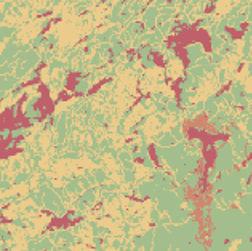
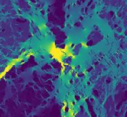
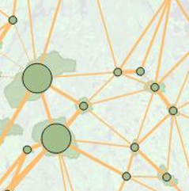
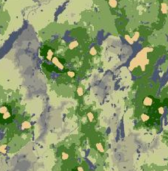

<h1 align="center">Connectivity Analysis scripts and tools</h1>

A set of Python and R scripts to help you do a 4 stages connectivity analysis for terrestrial non-flying species in a Landscape. All scripts are heavily commented to indicate what to do and what's happenning.

All of the analysis rely on a raster map that indicates the resistance cost of deplacement for the given species; in the current script, this map is generated with the methodology of [Pither et al. 2023](https://dx.plos.org/10.1371/journal.pone.0281980) for Canadian terrestrial non-flying species. However, you can generate your own resistance map with a different method, and use it in the other scripts.

  

## ⛔ First step : Computing a resistance map

The scripts in `1 - Creating Resistance Map` will help you create a cost resistance map according to the methodology of [Pither et al. 2023](https://dx.plos.org/10.1371/journal.pone.0281980) for Canadian terrestrial non-flying species.

The resulting map is used in all of the following scripts.

  

## ⚡ Second step : Computing a Circuitscape omnidirectional current map to visualize pinch points and general flux of individuals in the landscape

The scripts in `2 - Circuitscape Omnidirectional analysis` will allow you to generate a map of omnidirectional current that respresent the predicted flux of individuals in your landscape. See [Pither et al. 2023](https://dx.plos.org/10.1371/journal.pone.0281980) for more informations as to what these map are, and how they can be interpreted.

Cirtcuitscape 5.0 works with [Julia](https://julialang.org/), which you will need to install on your computer.

  

## 🔗 Third step : Computing a Minimal Planar Graph (MPG) to represent the network formed by protected areas in the landscape, and compute connectivity values for each, as well as modification for different scenarios (addition or removal of protected areas, etc.)

The scripts in `3 - Network (Graph) analysis` will help you generate a MPG based on the protected areas of the landscape acting as nodes of the networks, and links being the least-cost paths between them on the resistance map (see `Script_MPG_MountainsAndProtectedAreas_Manawan_Buffer.R`). They will then compute measures such as the difference of [Probability of Connectivity (dPC)](https://dx.doi.org/10.1111%2F2041-210X.12799) and the [Betweenness Centrality Index](dx.doi.org/10.1007%2Fs10980-006-9015-0) for each protected area, allowing you to identify the most important one connectivity-wise (`Script_MPG_MountainsAndProtectedAreas_Manawan_Buffer.R`).

Finally, these scripts will help you compute the [Equivalent Connectivity (or Equivalent Connected Area)](https://besjournals.onlinelibrary.wiley.com/doi/10.1111/2041-210X.12799) of the whole network of protected areas in different scenarios where protected areas are added or removed from the landscape, and creating a figure to easily compare the different scenarios (`script_Analyses_EC_Scenarios.R`).

  

## ➡ Fourth step : Computing a the ecological corridors in the landscape based on the methodology of [Linkage Mapper](https://github.com/linkagescape/linkage-mapper)

The scripts in `4 - Corridors analysis` will help you create a composite map of ecological corridors in the landscape between protected areas, based on the resistance map.
